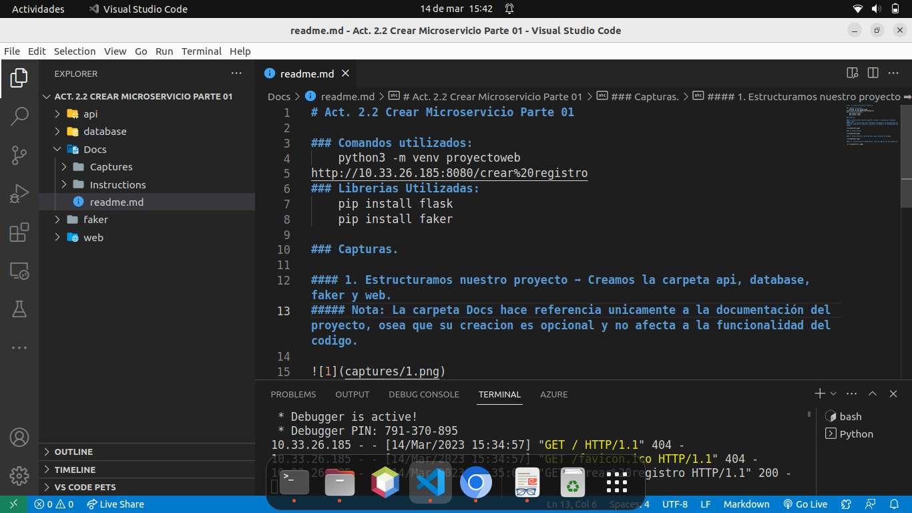
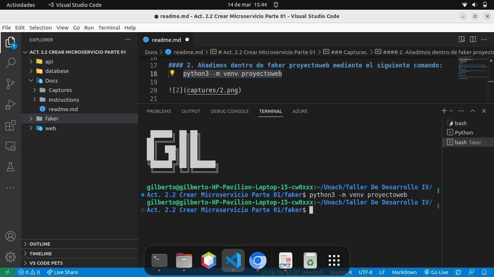
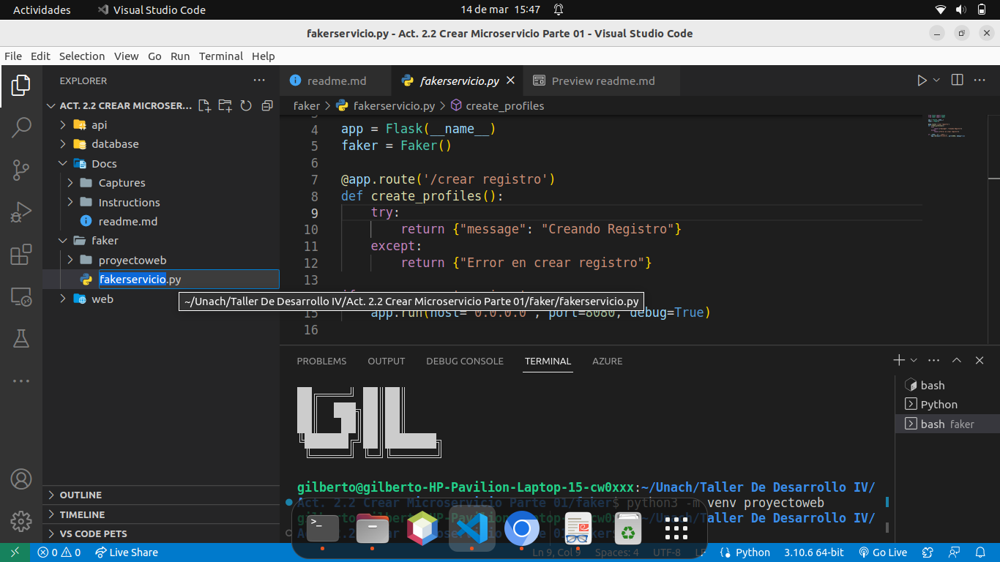
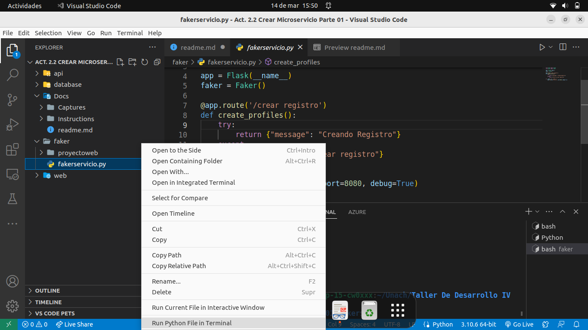
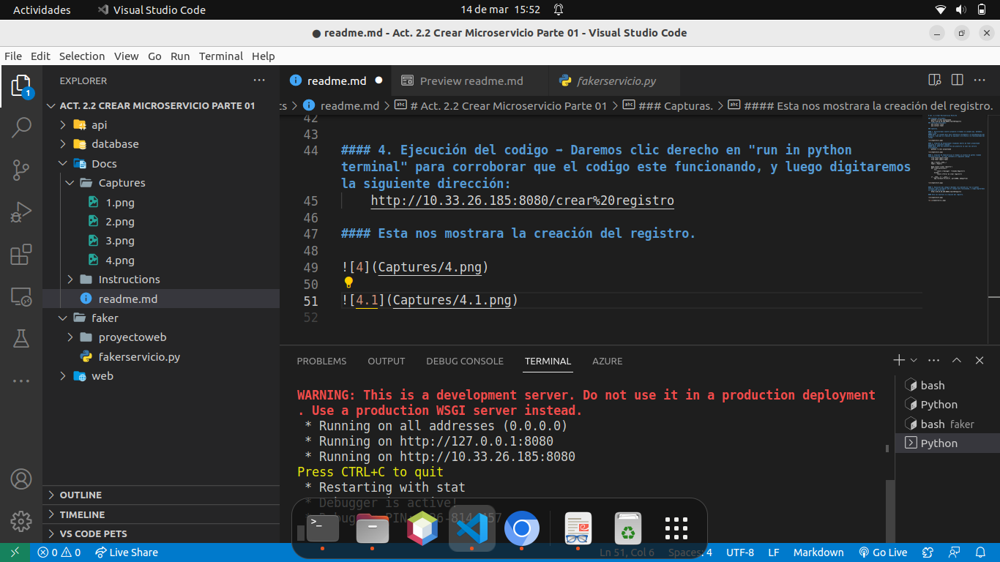

# Act. 2.2 Crear Microservicio Parte 01

### Comandos utilizados:
    python3 -m venv proyectoweb
    http://10.33.26.185:8080/crear%20registro
### Librerias Utilizadas:
    pip install flask
    pip install faker

### Capturas.

#### 1. Estructuramos nuestro proyecto ➡ Creamos la carpeta api, database, faker y web.
##### Nota: La carpeta Docs hace referencia unicamente a la documentación del proyecto, osea que su creacion es opcional y no afecta a la funcionalidad del codigo.

#### 2. Creación de proyectoweb ➡ Añadimos dentro de faker proyectoweb mediante el siguiente comando:
##### Nota: Este nos proovera de una plantilla la cual nos servira proximamente.
    python3 -m venv proyectoweb

#### 3. Creación de fakerservicio ➡ Creamos un archivo de python llamado fakerservicio.py , el cual contendra el siguiente codigo:
    from flask import Flask
    from faker import Faker

    app = Flask(__name__)
    faker = Faker()

    @app.route('/crear registro')
    def create_profiles():
        try:
            return {"message": "Creando Registro"}
        except:
            return {"Error en crear registro"}

    if __name__ == '__main__':
        app.run(host='0.0.0.0', port=8080, debug=True)
     

#### 4. Ejecución del codigo ➡ Daremos clic derecho en "run in python terminal" para corroborar que el codigo este funcionando.

#### Y luego en el navegador, digitaremos la siguiente dirección:
    http://10.33.26.185:8080/crear%20registro

#### Esta nos mostrara la creación del registro.

