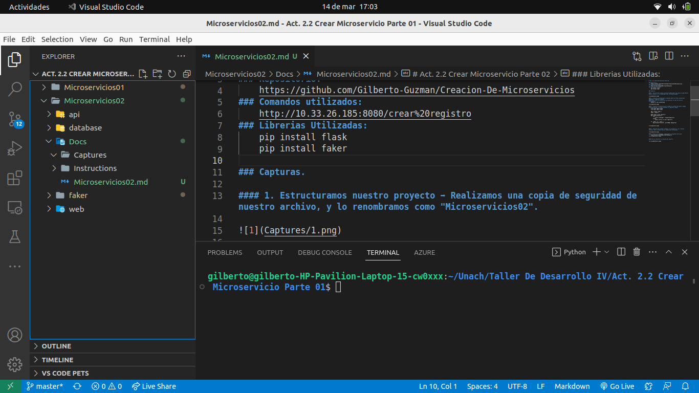
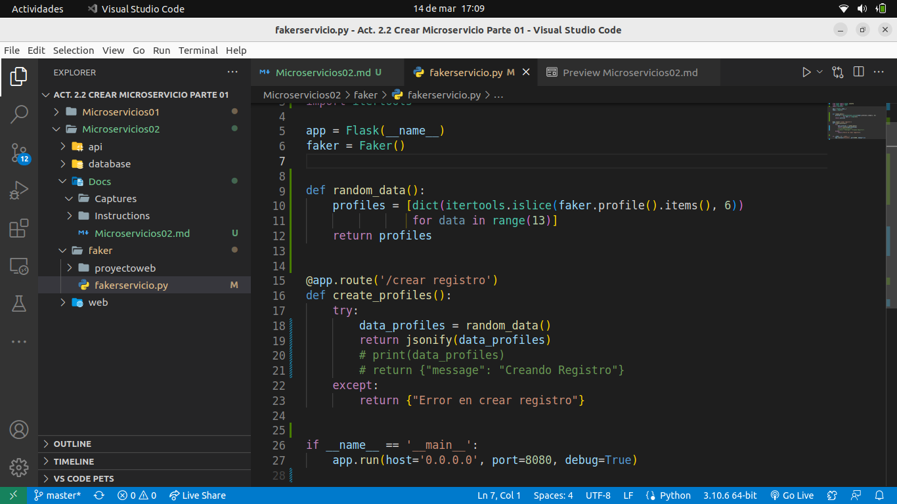
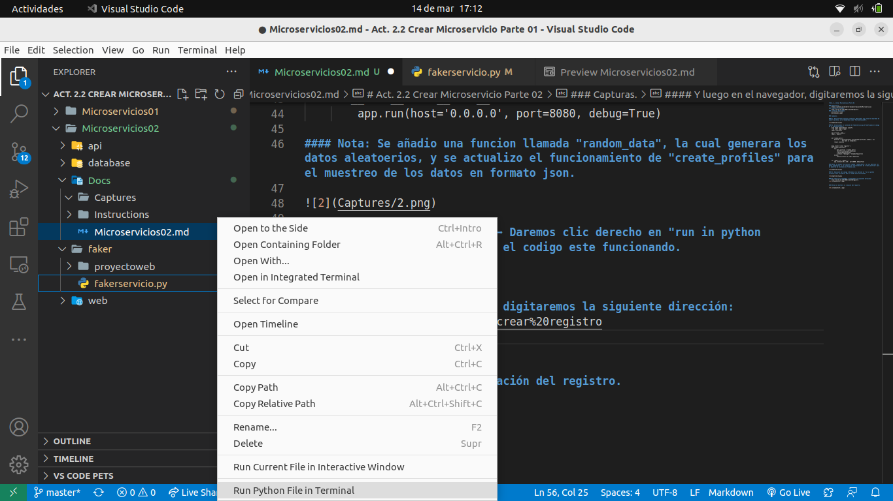
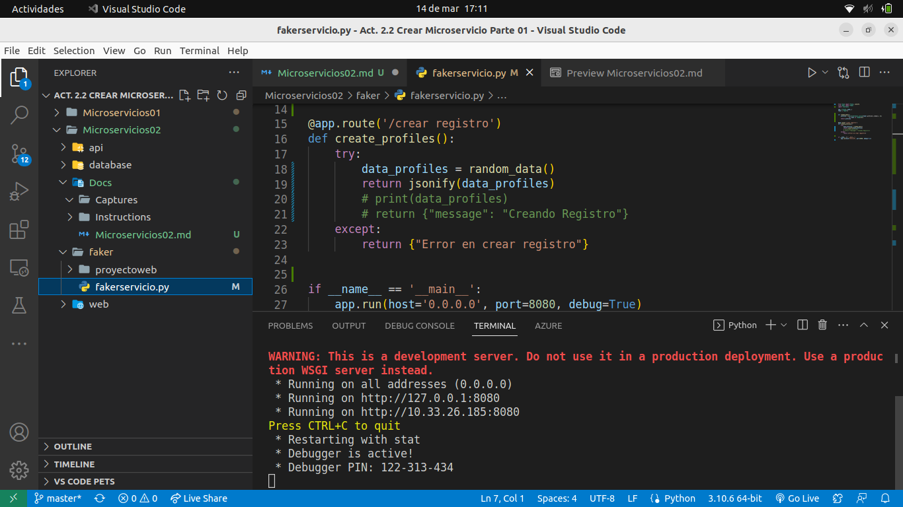
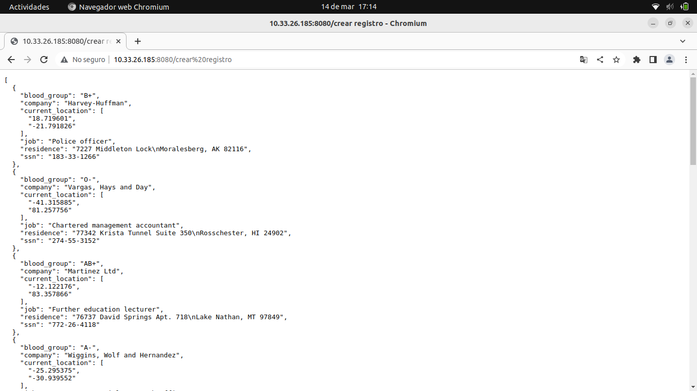

# Act. 2.2 Crear Microservicio Parte 02

### Repositorio:
    https://github.com/Gilberto-Guzman/Creacion-De-Microservicios/tree/master/Microservicios02
### Comandos utilizados:
    http://10.33.26.185:8080/crear%20registro
### Librerias Utilizadas:
    pip install flask
    pip install faker

### Capturas.

#### 1. Estructuramos nuestro proyecto ➡ Realizamos una copia de seguridad de nuestro archivo, y lo renombramos como "Microservicios02".

#### 2. Actualizamos el contenido de fakerservicio.py ➡ Modificamos el codigo de la siguiente manera:
    from flask import Flask, jsonify
    from faker import Faker
    import itertools

    app = Flask(__name__)
    faker = Faker()

    def random_data():
        profiles = [dict(itertools.islice(faker.profile().items(), 6))
                    for data in range(13)]
        return profiles

    @app.route('/crear registro')
    def create_profiles():
        try:
            data_profiles = random_data()
            return jsonify(data_profiles)
            # print(data_profiles)
            # return {"message": "Creando Registro"}
        except:
            return {"Error en crear registro"}

    if __name__ == '__main__':
        app.run(host='0.0.0.0', port=8080, debug=True)

#### Nota: Se añadio una funcion llamada "random_data", la cual generara los datos aleatoerios, y se actualizo el funcionamiento de "create_profiles" para el muestreo de los datos en formato json.

#### 3. Ejecución del codigo ➡ Daremos clic derecho en "run in python terminal" para corroborar que el codigo este funcionando.

#### Y luego en el navegador, digitaremos la siguiente dirección:
    http://10.33.26.185:8080/crear%20registro

#### Esta nos mostrara la creación del registro.
